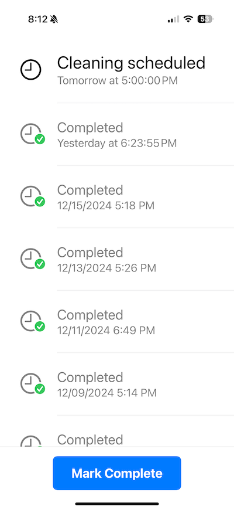
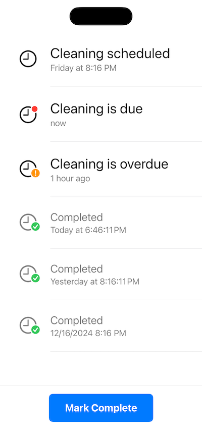

# LitterReminder
An app to schedule and track litter box cleanings. This is a real app I actually use 😆

Tap Mark Complete button to mark the scheduled cleaning as complete.
A new cleaning is automatically scheduled the day after tomorrow at 5:00 PM.
A reminder is added to the iOS Reminders app.
These settings are not yet configurable.

- Built with SwiftUI
- Uses SwiftData to persist data
- Creates a reminder using EventKit

Above: screenshot with data from real use. Below: SwiftUI preview showing various states.

