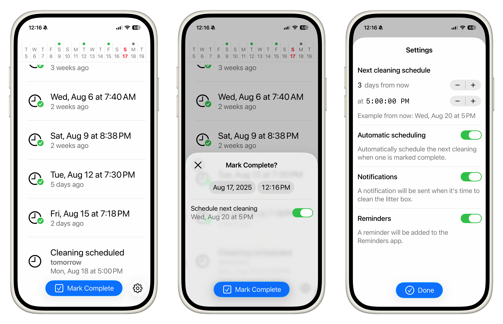

# LitterReminder
An app to schedule and track litter box cleanings. This is a real app I actually use 😆

Tap Mark Complete button to mark the scheduled cleaning as complete. A new cleaning is automatically scheduled the day after tomorrow at 5:00 PM. A reminder is added to the iOS Reminders app. The app will also show a notification when the cleaning is due. The notification supports marking it complete or snoozing until tomorrow.

Last built with Xcode 26 beta 4.

- Built with SwiftUI
- Uses SwiftData to persist data
- Creates a reminder using EventKit
- Creates local notifications with actions

